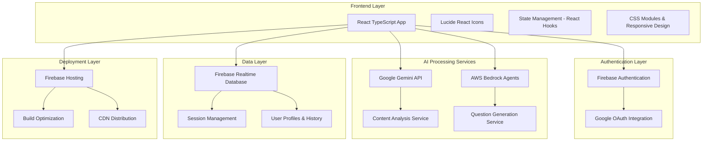

# Design Document

## Overview

StudyAlte is a React TypeScript-based web application that leverages Google Gemini AI and AWS Bedrock services to transform educational documents into comprehensive study materials and question papers. The system follows a modern frontend architecture with serverless backend integration, ensuring scalability, cost-effectiveness, and maintainability. The platform integrates multiple AI services for content analysis, question generation, and interactive learning material creation.

## Architecture

### High-Level Architecture



### Technology Stack

**Frontend:**
- React 18 with TypeScript
- Create React App for build tooling
- Lucide React for icons
- Custom CSS with responsive design
- React Hooks for state management
- React Router for navigation
- KaTeX for mathematical notation rendering

**Authentication:**
- Firebase Authentication
- Google OAuth 2.0 integration
- Context API for auth state management

**AI/ML Services:**
- Google Gemini API for content analysis and image processing
- AWS Bedrock for specialized question generation
- Custom agent selection based on subject area

**Data Storage:**
- Firebase Realtime Database for user sessions
- Local state management for temporary data
- Browser storage for offline capabilities

**Deployment:**
- Firebase Hosting for production deployment
- Automated build and deployment pipeline
- CDN distribution for global performance

## Components and Interfaces

### Frontend Components

```tsx
// App.tsx - Main application component
interface AppProps {
  user: User | null;
  authLoading: boolean;
  authError: string | null;
}

// Core UI Components
interface NavigationTabProps {
  id: string;
  name: string;
  icon: React.ComponentType;
  description: string;
}

interface UploadedFile {
  name: string;
  size: number;
  type: string;
  content: string;
  isImage: boolean;
}
```

#### Study Material Components

```tsx
// SummaryComponent.tsx
interface SummaryComponentProps {
  analysisResult: AnalysisResult | null;
  promptId?: string;
  loadedSummaryData?: SummaryData;
}

// MindMapComponent.tsx
interface MindMapComponentProps {
  analysisResult: AnalysisResult | null;
  promptId?: string;
  loadedMindMapData?: BedrockFlashCardSet;
}

// FlashCardComponent.tsx
interface FlashCardComponentProps {
  analysisResult: AnalysisResult | null;
  promptId?: string;
  loadedFlashCardSet?: FlashCardSet;
}
```

#### Question Generation Components

```tsx
// QuestionPaperDisplay.tsx
interface QuestionPaperDisplayProps {
  questionPaper: QuestionPaper;
}

// HistoryComponent.tsx
interface HistoryComponentProps {
  onRegenerateFromPrompt: (analysisResult: AnalysisResult, title: string) => void;
  onLoadSession: (historyItem: PromptHistory) => void;
  onClose: () => void;
}
```

### Service Interfaces

#### AI Analysis Service

```tsx
// geminiService.ts
interface AnalysisResult {
  analysis: {
    subject: string;
    topics: string[];
    difficulty: 'easy' | 'medium' | 'hard' | 'expert';
    confidence: number;
    extractedQuestions?: string[];
    questionPatterns?: string[];
    documentTypes?: string[];
    markingSchemes?: string[];
    languageStyle?: string;
    parsedRequirements?: ParsedRequirements;
  };
  threePrompts: {
    summaryPrompt: string;
    flashcardPrompt: string;
    mindmapPrompt: string;
  };
  paperPattern: string;
  contentQuality: number;
  processingTime: number;
}

interface SummaryData {
  title: string;
  subject: string;
  keyTopics: string[];
  mainConcepts: {
    topic: string;
    description: string;
    importance: string;
  }[];
  studyGuide: {
    section: string;
    points: string[];
  }[];
  timeEstimate: string;
  difficulty: string;
  generatedBy: string;
  timestamp: string;
}
```

#### AWS Bedrock Service

```tsx
// bedrockService.ts
interface BedrockAgent {
  id: string;
  name: string;
  description: string;
  subjects: string[];
  capabilities: string[];
}

interface QuestionPaper {
  title: string;
  subject: string;
  difficulty: string;
  totalQuestions: number;
  totalMarks: number;
  duration: string;
  sections: QuestionSection[];
  generatedBy: string;
  timestamp: string;
}
```

#### Database Service

```tsx
// databaseService.ts
interface PromptHistory {
  id: string;
  title: string;
  subject: string;
  createdAt: string;
  lastUsed: string;
  analysisResult: AnalysisResult;
}

interface SessionData {
  prompt: PromptHistory;
  summaryData?: SummaryData;
  flashCardSet?: FlashCardSet;
  bedrockFlashCardSet?: BedrockFlashCardSet;
  questionPaper?: QuestionPaper;
}
```

## Data Flow and State Management
```
```typescript
// Main App Component
interface AppProps {
  theme: Theme;
  user: User | null;
}

// Video Input Component
interface VideoInputProps {
  onVideoSubmit: (url: string) => Promise<void>;
  loading: boolean;
  error: string | null;
}

// Learning Capsule Component
interface LearningCapsuleProps {
  capsule: LearningCapsule;
  onUpdate: (capsule: LearningCapsule) => void;
}

// Flashcard Component
interface FlashcardProps {
  cards: Flashcard[];
  onProgress: (cardId: string, difficulty: number) => void;
  spacedRepetition: boolean;
}

// Quiz Component
interface QuizProps {
  questions: Question[];
  onComplete: (results: QuizResults) => void;
  timeLimit?: number;
}

// AI Tutor Chat Component
interface AITutorProps {
  capsuleId: string;
  context: string;
  onMessage: (message: string) => Promise<string>;
}
```

#### Layout Components
```typescript
// Main Layout
interface MainLayoutProps {
  children: React.ReactNode;
  sidebar: boolean;
  user: User;
}

// Sidebar Navigation
interface SidebarProps {
  capsules: LearningCapsule[];
  activeSection: string;
  onSectionChange: (section: string) => void;
}

// Progress Dashboard
interface ProgressDashboardProps {
  stats: UserStats;
  recentActivity: Activity[];
  goals: Goal[];
}
```

### Backend Service Interfaces

#### Video Processing Service
```typescript
interface VideoProcessingService {
  processVideo(url: string, userId: string): Promise<ProcessingJob>;
  getTranscript(videoId: string): Promise<Transcript>;
  extractMetadata(url: string): Promise<VideoMetadata>;
  generateThumbnail(videoId: string): Promise<string>;
}

interface ProcessingJob {
  jobId: string;
  status: 'pending' | 'processing' | 'completed' | 'failed';
  progress: number;
  estimatedCompletion: Date;
}
```

#### AI Content Generation Service
```typescript
interface AIContentService {
  generateSummary(transcript: string): Promise<Summary>;
  createFlashcards(content: string): Promise<Flashcard[]>;
  generateQuiz(content: string, difficulty: number): Promise<Question[]>;
  createMindMap(concepts: string[]): Promise<MindMap>;
  generateNotes(transcript: string): Promise<Note[]>;
}

interface Summary {
  keyPoints: string[];
  mainConcepts: string[];
  learningObjectives: string[];
  estimatedReadTime: number;
}
```

#### User Management Service
```typescript
interface UserService {
  createUser(userData: CreateUserRequest): Promise<User>;
  updateProfile(userId: string, updates: ProfileUpdate): Promise<User>;
  getUserPreferences(userId: string): Promise<UserPreferences>;
  deleteUser(userId: string): Promise<void>;
}

interface User {
  id: string;
  email: string;
  profile: UserProfile;
  preferences: UserPreferences;
  subscription: SubscriptionTier;
  createdAt: Date;
}
```

## Data Models

### Core Data Models

```typescript
// Learning Capsule Model
interface LearningCapsule {
  id: string;
  userId: string;
  videoId: string;
  title: string;
  description: string;
  thumbnail: string;
  duration: number;
  createdAt: Date;
  updatedAt: Date;
  tags: string[];
  category: string;
  difficulty: 'beginner' | 'intermediate' | 'advanced';
  
  // Generated Content
  summary: Summary;
  flashcards: Flashcard[];
  quiz: Quiz;
  notes: Note[];
  mindMap?: MindMap;
  transcript: Transcript;
  
  // Progress Tracking
  progress: CapsuleProgress;
  lastAccessed: Date;
}

// Flashcard Model
interface Flashcard {
  id: string;
  front: string;
  back: string;
  difficulty: number;
  nextReview: Date;
  reviewCount: number;
  correctCount: number;
  tags: string[];
  createdAt: Date;
}

// Quiz Model
interface Quiz {
  id: string;
  questions: Question[];
  timeLimit?: number;
  passingScore: number;
  attempts: QuizAttempt[];
}

interface Question {
  id: string;
  type: 'multiple-choice' | 'short-answer' | 'true-false';
  question: string;
  options?: string[];
  correctAnswer: string;
  explanation: string;
  difficulty: number;
  tags: string[];
}

// Progress Tracking Models
interface UserProgress {
  userId: string;
  totalCapsules: number;
  completedCapsules: number;
  totalStudyTime: number;
  streakDays: number;
  lastActivity: Date;
  skillLevels: Record<string, number>;
  achievements: Achievement[];
}

interface CapsuleProgress {
  capsuleId: string;
  completionPercentage: number;
  timeSpent: number;
  flashcardsReviewed: number;
  quizzesTaken: number;
  notesCreated: number;
  lastSection: string;
}
```

### Database Schema (DynamoDB)

```typescript
// Users Table
interface UsersTable {
  PK: string; // USER#${userId}
  SK: string; // PROFILE
  GSI1PK: string; // EMAIL#${email}
  GSI1SK: string; // USER
  
  userId: string;
  email: string;
  profile: UserProfile;
  preferences: UserPreferences;
  createdAt: string;
  updatedAt: string;
}

// Capsules Table
interface CapsulesTable {
  PK: string; // USER#${userId}
  SK: string; // CAPSULE#${capsuleId}
  GSI1PK: string; // CAPSULE#${capsuleId}
  GSI1SK: string; // CREATED#${timestamp}
  
  capsuleData: LearningCapsule;
  searchableContent: string;
  tags: string[];
}

// Progress Table
interface ProgressTable {
  PK: string; // USER#${userId}
  SK: string; // PROGRESS#${date}
  
  dailyStats: DailyStats;
  activities: Activity[];
}
```

## Error Handling

### Error Types and Handling Strategy

```typescript
// Custom Error Classes
class VideoProcessingError extends Error {
  constructor(
    message: string,
    public code: string,
    public retryable: boolean = false
  ) {
    super(message);
    this.name = 'VideoProcessingError';
  }
}

class AIServiceError extends Error {
  constructor(
    message: string,
    public service: string,
    public retryable: boolean = true
  ) {
    super(message);
    this.name = 'AIServiceError';
  }
}

// Error Handling Middleware
interface ErrorHandler {
  handleVideoError(error: VideoProcessingError): ErrorResponse;
  handleAIError(error: AIServiceError): ErrorResponse;
  handleValidationError(error: ValidationError): ErrorResponse;
  handleAuthError(error: AuthError): ErrorResponse;
}

// Frontend Error Boundary
interface ErrorBoundaryState {
  hasError: boolean;
  error: Error | null;
  errorInfo: ErrorInfo | null;
}
```

### Error Recovery Strategies

1. **Retry Logic**: Implement exponential backoff for transient failures
2. **Graceful Degradation**: Provide fallback content when AI services fail
3. **User Feedback**: Clear error messages with actionable next steps
4. **Monitoring**: Comprehensive logging and alerting for error tracking

## Testing Strategy

### Testing Pyramid

```typescript
// Unit Tests (70%)
describe('VideoProcessingService', () => {
  it('should extract valid YouTube video ID from URL', () => {
    const service = new VideoProcessingService();
    const videoId = service.extractVideoId('https://youtube.com/watch?v=abc123');
    expect(videoId).toBe('abc123');
  });
  
  it('should handle invalid YouTube URLs', () => {
    const service = new VideoProcessingService();
    expect(() => service.extractVideoId('invalid-url')).toThrow(ValidationError);
  });
});

// Integration Tests (20%)
describe('AI Content Generation Integration', () => {
  it('should generate flashcards from video transcript', async () => {
    const transcript = 'Sample educational content...';
    const flashcards = await aiService.createFlashcards(transcript);
    
    expect(flashcards).toHaveLength(greaterThan(0));
    expect(flashcards[0]).toHaveProperty('front');
    expect(flashcards[0]).toHaveProperty('back');
  });
});

// E2E Tests (10%)
describe('Complete Learning Flow', () => {
  it('should process video and create learning capsule', async () => {
    await page.goto('/');
    await page.fill('[data-testid=video-url-input]', 'https://youtube.com/watch?v=test');
    await page.click('[data-testid=process-button]');
    
    await page.waitForSelector('[data-testid=learning-capsule]');
    const capsuleTitle = await page.textContent('[data-testid=capsule-title]');
    expect(capsuleTitle).toBeTruthy();
  });
});
```

### Testing Tools and Frameworks

- **Unit Testing**: Jest, React Testing Library
- **Integration Testing**: Supertest for API testing
- **E2E Testing**: Playwright for browser automation
- **Performance Testing**: Lighthouse CI for performance metrics
- **Load Testing**: Artillery for API load testing

### Quality Assurance

1. **Code Coverage**: Minimum 80% coverage requirement
2. **Type Safety**: Strict TypeScript configuration
3. **Linting**: ESLint with Airbnb configuration
4. **Code Formatting**: Prettier for consistent formatting
5. **Pre-commit Hooks**: Husky for automated quality checks

## Security Considerations

### Authentication and Authorization
- AWS Cognito for user authentication
- JWT tokens for API authorization
- Role-based access control (RBAC)
- Multi-factor authentication (MFA) support

### Data Protection
- Encryption at rest (DynamoDB, S3)
### Security Considerations

- **API Key Management**: Environment variables for all API keys
- **Authentication**: Firebase Auth with Google OAuth
- **Data Validation**: Input sanitization and validation
- **Rate Limiting**: Client-side throttling for API calls
- **Error Information**: Sanitized error messages for production
- **Session Security**: Automatic session timeout and cleanup

### Performance Optimization

- **Code Splitting**: Lazy loading for components and routes
- **Bundle Optimization**: Tree shaking and minification
- **Caching**: Browser caching and Firebase CDN
- **Real-time Updates**: Optimized database queries
- **Error Recovery**: Automatic retry mechanisms
- **Progress Tracking**: Real-time feedback for long operations

### Monitoring and Analytics

- **Firebase Analytics**: User interaction tracking
- **Error Monitoring**: Centralized error logging
- **Performance Metrics**: Core Web Vitals monitoring
- **Usage Analytics**: Feature adoption and user patterns
- **A/B Testing**: Feature flag management for gradual rollouts