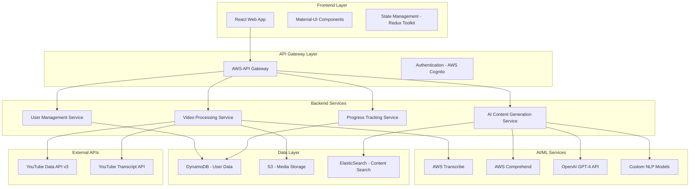

# Design Document

## Overview

The YouTube Learning Platform is a React-based web application that leverages AWS services and AI/ML capabilities to transform YouTube videos into interactive learning experiences. The system follows a microservices architecture with serverless components, ensuring scalability, cost-effectiveness, and maintainability. The platform integrates multiple AI services for content processing, natural language understanding, and personalized learning recommendations.

## Architecture

### High-Level Architecture



### Technology Stack

**Frontend:**
- React 18 with TypeScript
- Material-UI (MUI) for component library
- Redux Toolkit for state management
- React Query for server state management
- React Router for navigation
- Framer Motion for animations

**Backend:**
- AWS Lambda (Node.js/TypeScript)
- AWS API Gateway for REST APIs
- AWS Cognito for authentication
- AWS DynamoDB for NoSQL database
- AWS S3 for file storage
- AWS CloudFront for CDN

**AI/ML Services:**
- AWS Transcribe for speech-to-text
- AWS Comprehend for NLP analysis
- OpenAI GPT-4 API for content generation
- AWS SageMaker for custom ML models

## Components and Interfaces

### Frontend Components

#### Core Components
```typescript
// Main App Component
interface AppProps {
  theme: Theme;
  user: User | null;
}

// Video Input Component
interface VideoInputProps {
  onVideoSubmit: (url: string) => Promise<void>;
  loading: boolean;
  error: string | null;
}

// Learning Capsule Component
interface LearningCapsuleProps {
  capsule: LearningCapsule;
  onUpdate: (capsule: LearningCapsule) => void;
}

// Flashcard Component
interface FlashcardProps {
  cards: Flashcard[];
  onProgress: (cardId: string, difficulty: number) => void;
  spacedRepetition: boolean;
}

// Quiz Component
interface QuizProps {
  questions: Question[];
  onComplete: (results: QuizResults) => void;
  timeLimit?: number;
}

// AI Tutor Chat Component
interface AITutorProps {
  capsuleId: string;
  context: string;
  onMessage: (message: string) => Promise<string>;
}
```

#### Layout Components
```typescript
// Main Layout
interface MainLayoutProps {
  children: React.ReactNode;
  sidebar: boolean;
  user: User;
}

// Sidebar Navigation
interface SidebarProps {
  capsules: LearningCapsule[];
  activeSection: string;
  onSectionChange: (section: string) => void;
}

// Progress Dashboard
interface ProgressDashboardProps {
  stats: UserStats;
  recentActivity: Activity[];
  goals: Goal[];
}
```

### Backend Service Interfaces

#### Video Processing Service
```typescript
interface VideoProcessingService {
  processVideo(url: string, userId: string): Promise<ProcessingJob>;
  getTranscript(videoId: string): Promise<Transcript>;
  extractMetadata(url: string): Promise<VideoMetadata>;
  generateThumbnail(videoId: string): Promise<string>;
}

interface ProcessingJob {
  jobId: string;
  status: 'pending' | 'processing' | 'completed' | 'failed';
  progress: number;
  estimatedCompletion: Date;
}
```

#### AI Content Generation Service
```typescript
interface AIContentService {
  generateSummary(transcript: string): Promise<Summary>;
  createFlashcards(content: string): Promise<Flashcard[]>;
  generateQuiz(content: string, difficulty: number): Promise<Question[]>;
  createMindMap(concepts: string[]): Promise<MindMap>;
  generateNotes(transcript: string): Promise<Note[]>;
}

interface Summary {
  keyPoints: string[];
  mainConcepts: string[];
  learningObjectives: string[];
  estimatedReadTime: number;
}
```

#### User Management Service
```typescript
interface UserService {
  createUser(userData: CreateUserRequest): Promise<User>;
  updateProfile(userId: string, updates: ProfileUpdate): Promise<User>;
  getUserPreferences(userId: string): Promise<UserPreferences>;
  deleteUser(userId: string): Promise<void>;
}

interface User {
  id: string;
  email: string;
  profile: UserProfile;
  preferences: UserPreferences;
  subscription: SubscriptionTier;
  createdAt: Date;
}
```

## Data Models

### Core Data Models

```typescript
// Learning Capsule Model
interface LearningCapsule {
  id: string;
  userId: string;
  videoId: string;
  title: string;
  description: string;
  thumbnail: string;
  duration: number;
  createdAt: Date;
  updatedAt: Date;
  tags: string[];
  category: string;
  difficulty: 'beginner' | 'intermediate' | 'advanced';
  
  // Generated Content
  summary: Summary;
  flashcards: Flashcard[];
  quiz: Quiz;
  notes: Note[];
  mindMap?: MindMap;
  transcript: Transcript;
  
  // Progress Tracking
  progress: CapsuleProgress;
  lastAccessed: Date;
}

// Flashcard Model
interface Flashcard {
  id: string;
  front: string;
  back: string;
  difficulty: number;
  nextReview: Date;
  reviewCount: number;
  correctCount: number;
  tags: string[];
  createdAt: Date;
}

// Quiz Model
interface Quiz {
  id: string;
  questions: Question[];
  timeLimit?: number;
  passingScore: number;
  attempts: QuizAttempt[];
}

interface Question {
  id: string;
  type: 'multiple-choice' | 'short-answer' | 'true-false';
  question: string;
  options?: string[];
  correctAnswer: string;
  explanation: string;
  difficulty: number;
  tags: string[];
}

// Progress Tracking Models
interface UserProgress {
  userId: string;
  totalCapsules: number;
  completedCapsules: number;
  totalStudyTime: number;
  streakDays: number;
  lastActivity: Date;
  skillLevels: Record<string, number>;
  achievements: Achievement[];
}

interface CapsuleProgress {
  capsuleId: string;
  completionPercentage: number;
  timeSpent: number;
  flashcardsReviewed: number;
  quizzesTaken: number;
  notesCreated: number;
  lastSection: string;
}
```

### Database Schema (DynamoDB)

```typescript
// Users Table
interface UsersTable {
  PK: string; // USER#${userId}
  SK: string; // PROFILE
  GSI1PK: string; // EMAIL#${email}
  GSI1SK: string; // USER
  
  userId: string;
  email: string;
  profile: UserProfile;
  preferences: UserPreferences;
  createdAt: string;
  updatedAt: string;
}

// Capsules Table
interface CapsulesTable {
  PK: string; // USER#${userId}
  SK: string; // CAPSULE#${capsuleId}
  GSI1PK: string; // CAPSULE#${capsuleId}
  GSI1SK: string; // CREATED#${timestamp}
  
  capsuleData: LearningCapsule;
  searchableContent: string;
  tags: string[];
}

// Progress Table
interface ProgressTable {
  PK: string; // USER#${userId}
  SK: string; // PROGRESS#${date}
  
  dailyStats: DailyStats;
  activities: Activity[];
}
```

## Error Handling

### Error Types and Handling Strategy

```typescript
// Custom Error Classes
class VideoProcessingError extends Error {
  constructor(
    message: string,
    public code: string,
    public retryable: boolean = false
  ) {
    super(message);
    this.name = 'VideoProcessingError';
  }
}

class AIServiceError extends Error {
  constructor(
    message: string,
    public service: string,
    public retryable: boolean = true
  ) {
    super(message);
    this.name = 'AIServiceError';
  }
}

// Error Handling Middleware
interface ErrorHandler {
  handleVideoError(error: VideoProcessingError): ErrorResponse;
  handleAIError(error: AIServiceError): ErrorResponse;
  handleValidationError(error: ValidationError): ErrorResponse;
  handleAuthError(error: AuthError): ErrorResponse;
}

// Frontend Error Boundary
interface ErrorBoundaryState {
  hasError: boolean;
  error: Error | null;
  errorInfo: ErrorInfo | null;
}
```

### Error Recovery Strategies

1. **Retry Logic**: Implement exponential backoff for transient failures
2. **Graceful Degradation**: Provide fallback content when AI services fail
3. **User Feedback**: Clear error messages with actionable next steps
4. **Monitoring**: Comprehensive logging and alerting for error tracking

## Testing Strategy

### Testing Pyramid

```typescript
// Unit Tests (70%)
describe('VideoProcessingService', () => {
  it('should extract valid YouTube video ID from URL', () => {
    const service = new VideoProcessingService();
    const videoId = service.extractVideoId('https://youtube.com/watch?v=abc123');
    expect(videoId).toBe('abc123');
  });
  
  it('should handle invalid YouTube URLs', () => {
    const service = new VideoProcessingService();
    expect(() => service.extractVideoId('invalid-url')).toThrow(ValidationError);
  });
});

// Integration Tests (20%)
describe('AI Content Generation Integration', () => {
  it('should generate flashcards from video transcript', async () => {
    const transcript = 'Sample educational content...';
    const flashcards = await aiService.createFlashcards(transcript);
    
    expect(flashcards).toHaveLength(greaterThan(0));
    expect(flashcards[0]).toHaveProperty('front');
    expect(flashcards[0]).toHaveProperty('back');
  });
});

// E2E Tests (10%)
describe('Complete Learning Flow', () => {
  it('should process video and create learning capsule', async () => {
    await page.goto('/');
    await page.fill('[data-testid=video-url-input]', 'https://youtube.com/watch?v=test');
    await page.click('[data-testid=process-button]');
    
    await page.waitForSelector('[data-testid=learning-capsule]');
    const capsuleTitle = await page.textContent('[data-testid=capsule-title]');
    expect(capsuleTitle).toBeTruthy();
  });
});
```

### Testing Tools and Frameworks

- **Unit Testing**: Jest, React Testing Library
- **Integration Testing**: Supertest for API testing
- **E2E Testing**: Playwright for browser automation
- **Performance Testing**: Lighthouse CI for performance metrics
- **Load Testing**: Artillery for API load testing

### Quality Assurance

1. **Code Coverage**: Minimum 80% coverage requirement
2. **Type Safety**: Strict TypeScript configuration
3. **Linting**: ESLint with Airbnb configuration
4. **Code Formatting**: Prettier for consistent formatting
5. **Pre-commit Hooks**: Husky for automated quality checks

## Security Considerations

### Authentication and Authorization
- AWS Cognito for user authentication
- JWT tokens for API authorization
- Role-based access control (RBAC)
- Multi-factor authentication (MFA) support

### Data Protection
- Encryption at rest (DynamoDB, S3)
- Encryption in transit (HTTPS, TLS)
- PII data anonymization
- GDPR compliance measures

### API Security
- Rate limiting and throttling
- Input validation and sanitization
- CORS configuration
- API key management for external services

## Performance Optimization

### Frontend Optimization
- Code splitting and lazy loading
- Image optimization and lazy loading
- Service worker for offline functionality
- Bundle size optimization

### Backend Optimization
- Lambda cold start optimization
- DynamoDB query optimization
- Caching strategies (CloudFront, ElastiCache)
- Asynchronous processing for heavy operations

### Monitoring and Observability
- AWS CloudWatch for metrics and logs
- AWS X-Ray for distributed tracing
- Custom dashboards for business metrics
- Alerting for critical system events